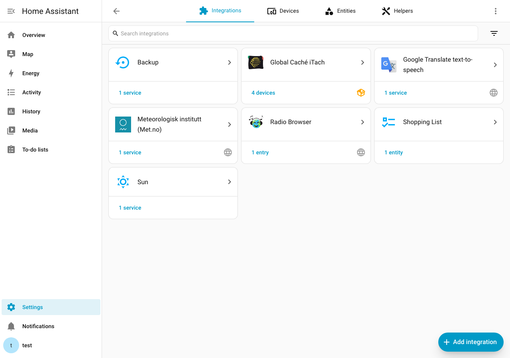
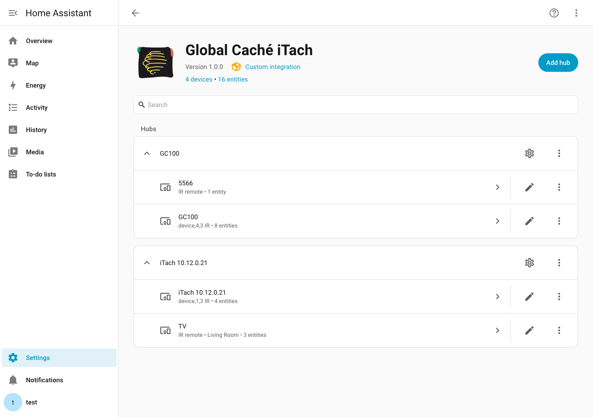
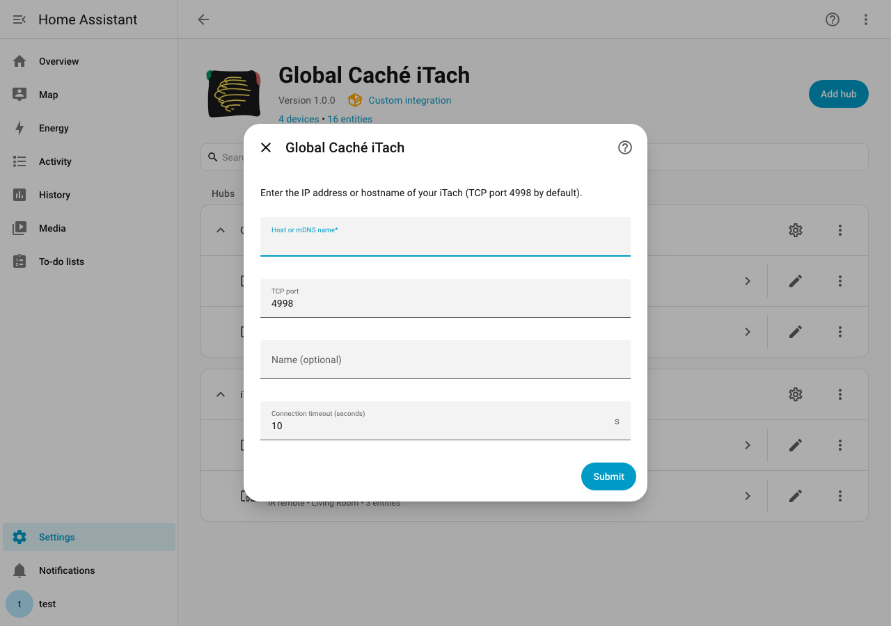
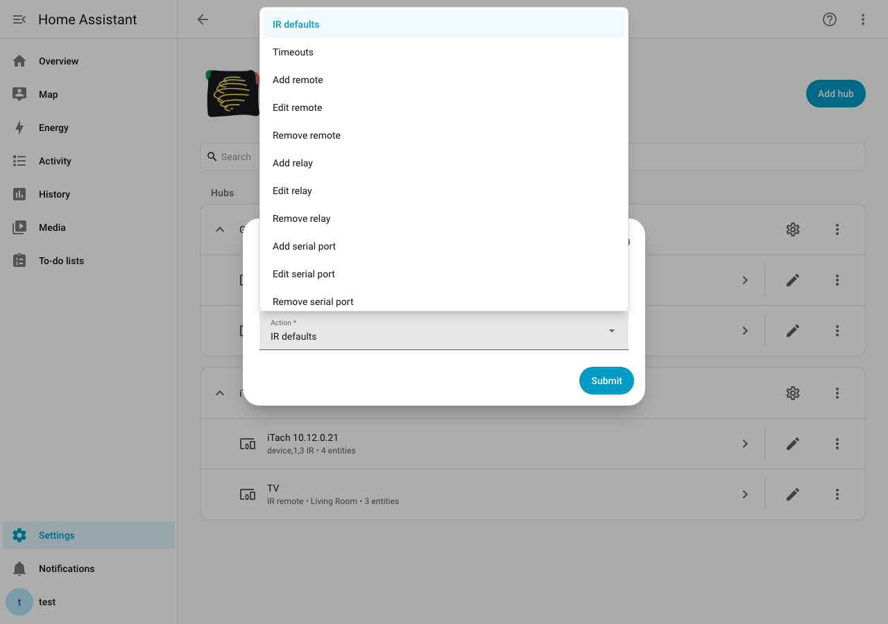
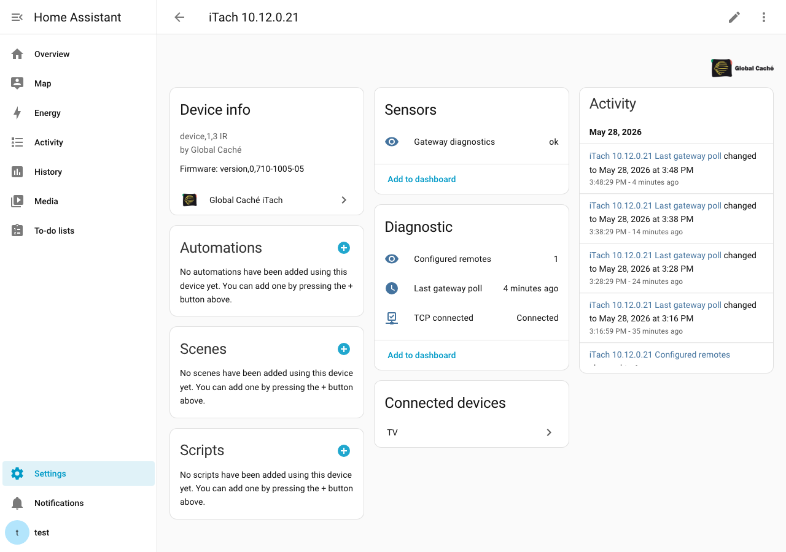
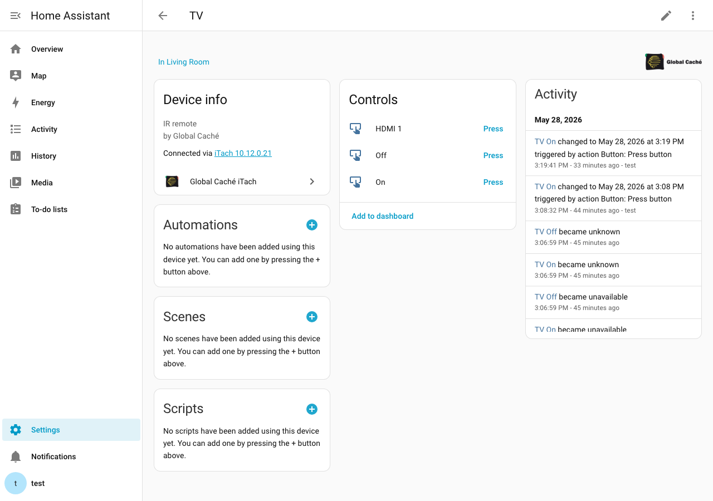
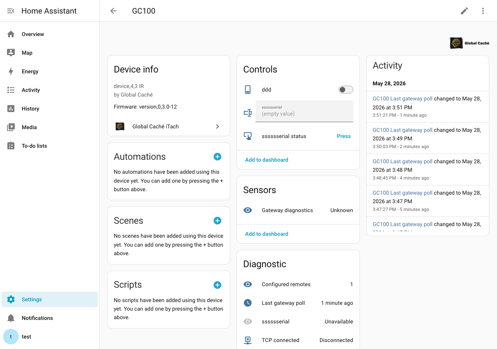

# Global Caché iTach (Home Assistant custom integration)

HACS-ready integration for **Global Caché iTach** and **GC-100** TCP/IP gateways (e.g. IP2IR, IP2CC, IP2SL). It adds a **config flow** (including optional **connect timeout**), **options flow** for IR defaults, remotes, **relays**, and **serial ports**, per-command **`button`** entities (Pronto, GC pulse pairs, or full **`sendir`** lines), **`switch`** / **`text`** / **`button`** entities for relay and serial connectors, diagnostic sensors, and **services** covering the TCP API (IR, LED, relay, serial, and raw lines).

Minimum Home Assistant version: **2024.1** (see [`hacs.json`](hacs.json)). The integration is declared as a **`hub`** (gateway) so Home Assistant does not offer a broken **“Add device”** device-subentry flow for a single-purpose TCP bridge.

There is **no `remote` platform** — each JSON command becomes its own **button** on a per-remote device (no generic on/off remote card).

## Screenshots

| Integrations list | Integration hubs & devices |
|---|---|
| [](docs/images/integrations.png) | [](docs/images/integration-detail.png) |

| Add / reconfigure hub | Options menu |
|---|---|
| [](docs/images/config-flow.png) | [](docs/images/options-menu.png) |

| Gateway device (diagnostics) | IR remote (command buttons) |
|---|---|
| [](docs/images/gateway-device.png) | [](docs/images/remote-device.png) |

| GC-100 gateway (relay + serial) |
|---|
| [](docs/images/gc100-gateway.png) |

## Install

1. Copy [`custom_components/globalcache_itach`](custom_components/globalcache_itach) into your Home Assistant `config/custom_components/` directory, or add this repository to **HACS** as a custom repository (type: Integration).
2. Restart Home Assistant.
3. Go to **Settings → Devices & services → Add integration** and search for **Global Caché iTach**.


## Run with Docker

From the repository root (Docker Desktop or another engine with Compose v2):

```bash
docker compose up -d
```

Open [http://localhost:8123](http://localhost:8123), complete the onboarding wizard, then add **Global Caché iTach** under **Settings → Devices & services**.

- **Config volume**: [`docker_data/config`](docker_data/config) stores Home Assistant’s full `/config` (ignored by git except [`.gitkeep`](docker_data/config/.gitkeep)).
- **Integration mount**: the container bind-mounts [`custom_components/globalcache_itach`](custom_components/globalcache_itach) into `/config/custom_components/globalcache_itach` read-only so edits in the repo are visible after **Developer tools → YAML → Restart** (or a container restart).

```bash
docker compose logs -f homeassistant
docker compose down
```

To use **mDNS / discovery** for devices on your LAN from the container, you may need `network_mode: host` (Linux only) or extra `cap_add` / macvlan setups; for a fixed iTach IP, bridge networking is usually enough.

## Configure

### First-time setup

Gateways are discovered automatically when they are visible on your LAN:

- **UDP multicast beacons** (Global Caché native protocol on `239.255.250.250:9131`) appear under **Settings → Devices & services → Discovered integrations**.
- **DHCP** hostname `GlobalCache_[MAC]` is used as a fallback when multicast is blocked (common in Docker bridge mode).

When you add the integration manually, it also scans the network for about five seconds and offers any gateways found before asking for an address.

- **Host**: IP, hostname, or mDNS name.
- **TCP port**: default **4998**.
- **Friendly name** (optional).
- **Connect timeout** (optional): validated with `getdevices` / `getversion` before the entry is created.


Use **Add hub** on the integration page to add another gateway. **⋮ → Reconfigure** updates host/port/name/timeouts, re-probes `getdevices`, and reloads the entry.

### Integration options

Open **Configure** on the integration card (gear icon on older layouts):


| Action | Purpose |
|--------|---------|
| **IR defaults** | Carrier frequency, repeat, offset, sendir ID policy (auto-increment vs fixed). |
| **Timeouts** | Connect and command timeouts. |
| **Add remote** | Name, module/port (e.g. module `1`, port `2` → connector **1:2**), repeat multiplier, **JSON command list**. |
| **Edit remote** / **Remove remote** | Change or delete a configured remote (entity IDs stay stable on edit). |
| **Add relay** / **Edit relay** / **Remove relay** | Relay `switch` entities via `setstate` / `getstate`. |
| **Add serial port** / **Edit serial** / **Remove serial** | Serial `text` entity, optional preset **buttons**, **Last received** sensor. |

### Devices and entities

Each **gateway** is one hub device with diagnostic sensors (**TCP connected**, **Last gateway poll**, **Configured remotes**, optional **Gateway diagnostics**). Each configured **remote** appears as a child device with one **button** per JSON command.


**Relays** and **serial ports** attach to the gateway device (GC-100 example with relay switch, serial text, and preset button):


**Diagnostics in the UI:** enable **Gateway diagnostics** (off by default) to see raw `getdevices` / `getversion` text. On the device page use **⋮ → Download diagnostics** for a JSON bundle (entry data/options, coordinator snapshot, live probes).

### Command JSON format

Each command is an object:

| Field | Required | Description |
|--------|----------|-------------|
| `name` | yes | Button entity label; matched case-insensitively in services if needed. |
| `data` | yes | Pronto hex, comma-separated GC pulse pairs, or a full `sendir,...` line (no trailing CR) when using `full_sendir`. |
| `format` | no | `pronto` (alias `pronto_hex`), `gc_pairs` (alias `gc_sendir_tail`), or `full_sendir`. |
| `freq`, `repeat`, `offset`, `command_id` | no | Overrides for that command only. |

Example:

```json
[
  {
    "name": "power",
    "format": "pronto",
    "data": "0000 006D 0000 0022 00AC 00AC 0015 0040"
  }
]
```

Serial preset JSON uses `name` and `payload` (see options hint text).

### Automations and dashboards

- **Buttons**: `button.press` on the command entity (e.g. `button.tv_on`).
- **Services**: `globalcache_itach.sendir`, `globalcache_itach.send_command`, `set_relay`, `send_serial`, etc. (see [`services.yaml`](custom_components/globalcache_itach/services.yaml)).
- Add controls from the device page with **Add to dashboard**.

## API mapping (iTach TCP ↔ Home Assistant)

| iTach / unified TCP | Home Assistant |
|---------------------|----------------|
| `sendir` (Pronto → GC conversion) | Per-command **button** entities, `globalcache_itach.sendir` / `send_command` services |
| `completeir` / `busyIR` | Handled internally in the TCP client |
| `stopir` | `globalcache_itach.stop_ir` service |
| `set_LED_LIGHTING` / `get_LED_LIGHTING` | `globalcache_itach.set_led_lighting` / `get_led_lighting` |
| `get_IR` / `set_IR` | `globalcache_itach.get_ir` / `set_ir` |
| `get_IRL` / `stop_IRL` | `globalcache_itach.ir_learner_start` / `ir_learner_stop` (+ bus event `globalcache_itach_ir_learned`) |
| `receiveIR` | `globalcache_itach.receive_ir` (+ bus event `globalcache_itach_ir_received` when unsolicited `sendir`/`IR` lines arrive) |
| `getdevices`, `getversion`, `get_NET` | Coordinator refresh, **Gateway diagnostics** sensor (off by default), diagnostics download, and `get_devices` / `get_version` / `get_net` services |
| Arbitrary ASCII line | `globalcache_itach.send_raw` or **`send_command`** (same behaviour; collects lines for `collect_seconds`) |
| `setstate` / `getstate` | **Configure → Add relay** → `switch` entities; services `set_relay`, `get_relay`, `pulse_relay` |
| `get_SERIAL` / `set_SERIAL` + serial data port | **Configure → Add serial port** → `text` (+ optional **button** presets), **Last received** sensor, bus event `globalcache_itach_serial_received` when **Monitor incoming data** is enabled; services `send_serial`, `get_serial`, `set_serial` |

Protocol reference: [iTach API (PDF)](https://www.globalcache.com/files/docs/API-iTach.pdf), [Unified TCP API (PDF)](https://globalcache.com/files/docs/API-GC-UnifiedTCPv1.1.pdf).

## Limitations

- One **serialized** TCP client per config entry with **connect retries** and **EOF recovery** so the next command opens a new session. Multiple Home Assistant instances or other controllers talking to the same iTach can still contend on port **4998**.
- **Relay** and **serial** connectors are configured in **integration options** (like remotes). Serial payloads use the Unified TCP data socket (**control port + module**, e.g. 4999 for module 1 when control is 4998). Confirm module/port wiring on your SKU (IP2CC relays are often module **3**; **GC-100-12** relays are module **3**, IR emitters modules **4** and **5** — run `get_devices` or check diagnostics).
- **GC-100** allows only **one** TCP client on port **4998** at a time; avoid iHelp/other tools holding that port while Home Assistant is connected.
- **IR learner** output is exposed via events and logs; it does not replace Global Caché’s **iLearn** utility for every workflow.
- Removing a remote, relay, or serial port from options **deletes** its entities from the registry on reload (they are not left as orphaned grey entities).

## Development

```bash
pip install pytest pytest-asyncio voluptuous
pytest tests/
```

The test suite (32 tests) exercises **Pronto parsing**, **device/entity helpers**, **serial sessions**, and the **async TCP client** against a fake iTach server (no Home Assistant install required for those tests).

### Refreshing README screenshots

With the Docker dev instance running (`docker compose up -d`):

```bash
pip install playwright requests pyyaml
python3 -m playwright install chromium
export HA_REFRESH_TOKEN="<refresh token from your dev HA>"
python3 scripts/capture_screenshots.py
```

Screenshots are defined in [`docs/screenshot-manifest.yaml`](docs/screenshot-manifest.yaml) and written to [`docs/images/`](docs/images/). The script uses the personal Cursor skill **`ha-integration-screenshots`** (`~/.cursor/skills/ha-integration-screenshots/`). List device IDs with `--discover-devices` when updating the manifest.

Contributor handoff notes: [`CONTEXT.md`](CONTEXT.md).

## Legal

“Global Caché” and “iTach” are trademarks of their respective owners. This project is an independent open-source integration and is not affiliated with Global Caché.
